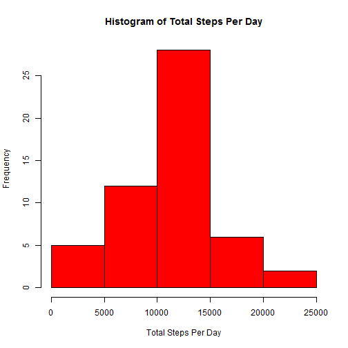
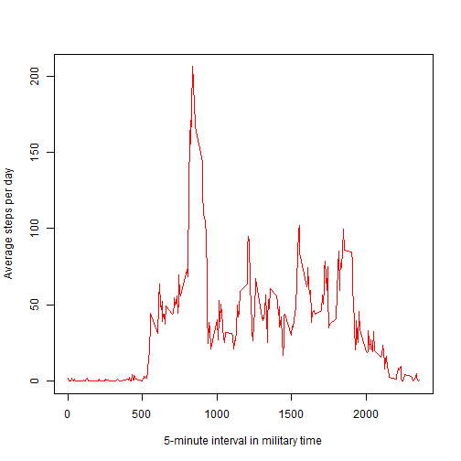
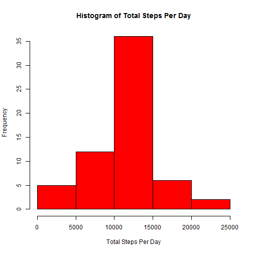

This is an analysis of the Activity Monitoring Data. 

First, we will download the data and import it using R.

1. Load the data (i.e. read.csv())

2. Process/transform the data (if necessary) into a format suitable for your analysis


```r
f <- "activity.csv"

if(!file.exists(f)){
        ## Data will to be downloaded the file to a temp directory.
        DateDownloaded <- Sys.time()
        url <- "http://d396qusza40orc.cloudfront.net/repdata%2Fdata%2Factivity.zip"
        td <- tempdir()
        temp <- tempfile(tmpdir=td, fileext=".zip")
        download.file(url, temp, mode="wb")
        
        ##unzip the zip folder to the wd and delete temp data
        unzip(temp)
        unlink(temp)
        rm(temp,td,url)
}

temp <- read.table(f, header = TRUE, sep=",",
                   stringsAsFactors = FALSE, na.strings = "NA")

rm(f)
```

###What is the mean total number of steps taken per day?

1. Calculate the total number of steps taken per day

```r
TotalPerDay <- aggregate(steps ~ date, temp,sum)
TotalPerDay
```

```
##          date steps
## 1  2012-10-02   126
## 2  2012-10-03 11352
## 3  2012-10-04 12116
## 4  2012-10-05 13294
## 5  2012-10-06 15420
## 6  2012-10-07 11015
## 7  2012-10-09 12811
## 8  2012-10-10  9900
## 9  2012-10-11 10304
## 10 2012-10-12 17382
## 11 2012-10-13 12426
## 12 2012-10-14 15098
## 13 2012-10-15 10139
## 14 2012-10-16 15084
## 15 2012-10-17 13452
## 16 2012-10-18 10056
## 17 2012-10-19 11829
## 18 2012-10-20 10395
## 19 2012-10-21  8821
## 20 2012-10-22 13460
## 21 2012-10-23  8918
## 22 2012-10-24  8355
## 23 2012-10-25  2492
## 24 2012-10-26  6778
## 25 2012-10-27 10119
## 26 2012-10-28 11458
## 27 2012-10-29  5018
## 28 2012-10-30  9819
## 29 2012-10-31 15414
## 30 2012-11-02 10600
## 31 2012-11-03 10571
## 32 2012-11-05 10439
## 33 2012-11-06  8334
## 34 2012-11-07 12883
## 35 2012-11-08  3219
## 36 2012-11-11 12608
## 37 2012-11-12 10765
## 38 2012-11-13  7336
## 39 2012-11-15    41
## 40 2012-11-16  5441
## 41 2012-11-17 14339
## 42 2012-11-18 15110
## 43 2012-11-19  8841
## 44 2012-11-20  4472
## 45 2012-11-21 12787
## 46 2012-11-22 20427
## 47 2012-11-23 21194
## 48 2012-11-24 14478
## 49 2012-11-25 11834
## 50 2012-11-26 11162
## 51 2012-11-27 13646
## 52 2012-11-28 10183
## 53 2012-11-29  7047
```

2. Make a histogram of the total number of steps taken each day

```r
hist(TotalPerDay$steps, col="red", xlab="Total Steps Per Day",
     main="Histogram of Total Steps Per Day")
```

 

3. Calculate and report the mean and median of the total number of steps taken per day 

```r
mean(TotalPerDay$steps, na.rm = TRUE)
```

```
## [1] 10766.19
```


```r
median(TotalPerDay$steps, na.rm = TRUE)
```

```
## [1] 10765
```

###What is the average daily activity pattern?  
Make a time series plot (i.e. type = "l") of the 5-minute interval (x-axis) and the average number of steps taken, averaged across all days (y-axis)  

```r
m <- aggregate(steps ~ interval, temp, mean)

plot(m$interval, m$steps, type = "l", xlab = "5-minute interval in military time", 
     ylab = "Average steps per day", col = "red")
```

 

Which 5-minute interval, on average across all the days in the dataset, contains the maximum number of steps?

```r
i <- m[grep(max(m$steps, na.rm = TRUE),m$steps),]
i
```

```
##     interval    steps
## 104      835 206.1698
```
The interval that contains the maximum number is steps is 835 with 206.1698113 steps.


```r
rm(i,m) ##remove variable to free up space
```

###Imputing missing values

Note that there are a number of days/intervals where there are missing values (coded as NA). The presence of missing days may introduce bias into some calculations or summaries of the data.

Calculate and report the total number of missing values in the dataset (i.e. the total number of rows with NAs)

```r
sum(is.na(temp$steps))
```

```
## [1] 2304
```

Devise a strategy for filling in all of the missing values in the dataset. The strategy does not need to be sophisticated. For example, you could use the mean/median for that day, or the mean for that 5-minute interval, etc.

>STRATEGY: Will fill in the NA values with mean for the interval.

Create a new dataset that is equal to the original dataset but with the missing data filled in.


```r
tempNew <- temp

intmean <- aggregate(steps ~ interval, tempNew,mean)

for(j in 1:nrow(tempNew))
{
        x <- tempNew[j,]
        if(is.na(x$steps)){
                y <- subset(intmean,intmean$interval == x$interval,select=steps)
                tempNew[j,1] <- y
        }
}

rm(temp, intmean) ##remove variable to free up space
```

Make a histogram of the total number of steps taken each day 


```r
TotalPerDayNew <- aggregate(steps ~ date, tempNew,sum)

hist(TotalPerDayNew$steps, col="red", xlab="Total Steps Per Day",
     main="Histogram of Total Steps Per Day")
```

 

and Calculate and report the mean and median total number of steps taken per day. 

```r
mean(TotalPerDayNew$steps, na.rm = TRUE)
```

```
## [1] 10766.19
```

```r
median(TotalPerDayNew$steps, na.rm = TRUE)
```

```
## [1] 10766.19
```

Do these values differ from the estimates from the first part of the assignment? What is the impact of imputing missing data on the estimates of the total daily number of steps?

```r
mean(TotalPerDayNew$steps, na.rm = TRUE) - mean(TotalPerDay$steps, na.rm = TRUE)
```

```
## [1] 0
```

```r
median(TotalPerDayNew$steps, na.rm = TRUE) - median(TotalPerDay$steps, na.rm = TRUE)
```

```
## [1] 1.188679
```

```r
rm(TotalPerDayNew, TotalPerDay) ##remove variable to free up space
```

###Are there differences in activity patterns between weekdays and weekends?

Create a new factor variable in the dataset with two levels - "weekday" and "weekend" indicating whether a given date is a weekday or weekend day.

```r
library(lubridate)

wd <- paste(tempNew$date)
day<- weekdays(as.Date(wd))
tempNew<- data.frame(tempNew,day)

wdays<- c("Monday","Tuesday","Wednesday","Thursday","Friday")
tempNew <- data.frame(tempNew,factor((tempNew$day %in% wdays)+1,levels=1:2, 
                            labels=c("weekend", "weekday")))
colnames(tempNew)[5] <- "Weekday"

rm(wd,day,wdays) ##remove variable to free up space
```

Make a panel plot containing a time series plot (i.e. type = "l") of the 5-minute interval (x-axis) and the average number of steps taken, averaged across all weekday days or weekend days (y-axis). 

```r
library(ggplot2)
m <- data.frame(aggregate(steps ~ interval+Weekday, tempNew, mean))


ggplot(m, aes(x=interval,y=steps)) + geom_line() + facet_wrap( ~ Weekday, ncol= 1) + 
        theme(axis.text.x=element_text(angle=0,vjust=0,hjust=0.5)) + 
        labs(x = "Interval", y = "Number of steps")
```

 

```r
rm(m,tempNew,x,y,j) ##remove variable to free up space
```

